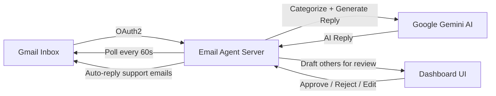

# 🤖 Email Agent

Your AI-powered email agent is built and ready to configure. This system monitors your Gmail inbox, categorizes incoming messages using Google Gemini, and either auto-replies to support emails or drafts responses for your review.

## 🚀 Setup Guide

### Step 1: Install Dependencies

Open a terminal in the project root and run:

```bash
npm install
```

### Step 2: Google Cloud Setup

#### 2a. Create a Google Cloud Project
1. Go to [Google Cloud Console](https://console.cloud.google.com/)
2. Create a new project (or use an existing one)
3. Enable the **Gmail API**:
   - Navigate to **APIs & Services → Library**
   - Search for "Gmail API" → Click **Enable**

#### 2b. Create OAuth2 Credentials
1. Go to **APIs & Services → Credentials**
2. Click **Create Credentials → OAuth client ID**
3. Application type: **Web application**
4. Add **Authorized redirect URI**: `http://localhost:3000/auth/google/callback`
5. Copy the **Client ID** and **Client Secret**

#### 2c. Configure OAuth Consent Screen
1. Go to **APIs & Services → OAuth consent screen**
2. Set up as **External** (or Internal if using Workspace)
3. Add your email as a **test user** (required while in testing mode)
4. Add scopes: `gmail.readonly`, `gmail.send`, `gmail.modify`, `userinfo.email`

#### 2d. Get a Gemini API Key
1. Go to [Google AI Studio](https://aistudio.google.com/apikey)
2. Click **Create API Key**
3. Copy the key

### Step 3: Configure Environment

Copy the example env file and fill in your credentials:

```bash
copy .env.example .env
```

Edit `.env` with your values:

```env
GOOGLE_CLIENT_ID=your_client_id_here
GOOGLE_CLIENT_SECRET=your_client_secret_here
GOOGLE_REDIRECT_URI=http://localhost:3000/auth/google/callback
GEMINI_API_KEY=your_gemini_api_key_here
PORT=3000
POLL_INTERVAL_MS=60000
USER_NAME=Your Name
USER_EMAIL=your.email@gmail.com
USER_ROLE=Professional
REPLY_TONE=professional
REPLY_SIGNATURE=Best regards
```

### Step 4: Run the Agent

```bash
npm run dev
```

Open **http://localhost:3000** in your browser.

### Step 5: Connect Gmail & Start Monitoring

1. Click **🔗 Connect Gmail Account** on the dashboard
2. Authorize with your Google account
3. Click **▶️ Start Monitor** in the top bar
4. Add auto-reply rules under **⚡ Auto-Reply Rules**

---

## 🛠️ Architecture & Features

### How It Works



| Feature | Behavior |
|---|---|
| **Support emails** | Auto-categorized by Gemini → Auto-replied immediately |
| **Other emails** | AI drafts a reply → Saved to **Draft Queue** for your review |
| **Draft Queue** | View original email + AI reply → **Approve**, **Edit**, or **Reject** |
| **Rules** | Match by sender, subject, or body → Auto-reply, draft, or ignore |
| **Settings** | Configure your name, role, reply tone, signature, and AI instructions |

### Project Structure

```
.
├── server.js                  # Express server entry point
├── package.json               # Dependencies
├── .env.example               # Environment template
├── config/
│   └── database.js            # SQLite schema & initialization
├── services/
│   ├── gmail.service.js       # Gmail API (OAuth2, read, send)
│   ├── gemini.service.js      # Gemini AI (reply generation, categorization)
│   └── monitor.service.js     # Email polling orchestrator
├── routes/
│   ├── auth.js                # OAuth2 flow
│   └── api.js                 # REST API (emails, drafts, rules, settings)
├── public/
│   ├── index.html             # Dashboard shell
│   ├── styles.css             # Premium dark theme
│   └── app.js                 # SPA frontend logic
└── data/                      # SQLite database (auto-created)
```

> [!TIP]
> The monitor polls every 60 seconds by default. You can change this in **Settings → Poll Interval**.

> [!WARNING]
> While your Google Cloud project is in "Testing" mode, you must add your Gmail as a test user in the OAuth consent screen. Otherwise the auth flow will fail.
